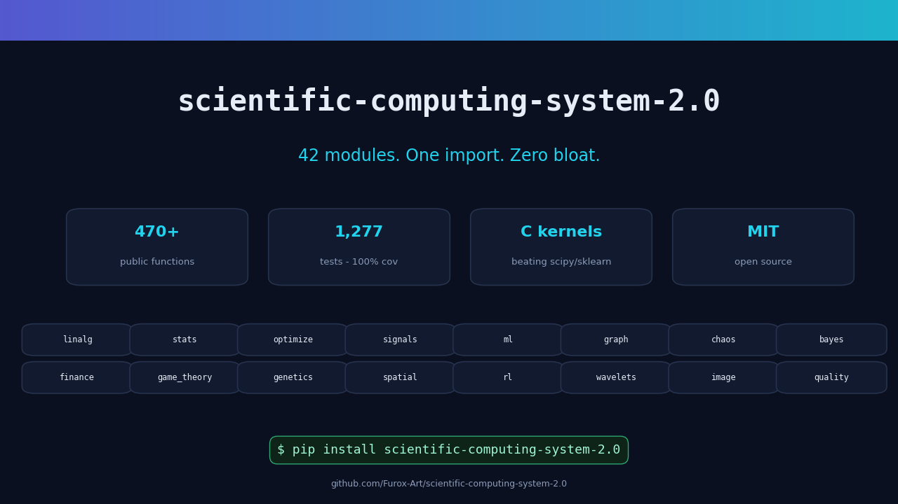

# scientific-computing-system-2.0

<p align="center">
  
</p>

[](https://github.com/Furox-Art/scientific-computing-system-2.0/actions/workflows/tests.yml)
[](https://pypi.org/project/scientific-computing-system-2.0/)
[](https://pypi.org/project/scientific-computing-system-2.0/)
[](LICENSE)
[](https://github.com/astral-sh/ruff)

**CDS v2** is a scientific computing platform built on the scientific Python
stack: NumPy, SciPy, pandas and matplotlib. The algorithms proven in the
pure-Python [scientific-computing-system](https://github.com/Furox-Art/scientific-computing-system)
(v1.x) form its foundation; v2 rebuilds them for speed and adds new domain
modules on top.

For data/model fitting, CDS also includes a guided scientific workflow that
recommends one candidate model while keeping model choice, missing-data
treatment and outlier handling under explicit user control. It records
reproducibility metadata, cross-checks fits numerically, reports uncertainty
and held-out validation metrics, and can generate PNG/PDF fit and residual
plots plus PDF/HTML/Markdown reports.

## Installation

```bash
pip install scientific-computing-system-2.0
```

From source:

```bash
git clone https://github.com/Furox-Art/scientific-computing-system-2.0.git
cd scientific-computing-system-2.0
pip install -e .[dev]
```

## Quick start

```python
import numpy as np
import cds2

# Linear algebra
A = [[3.0, 1.0], [1.0, 2.0]]
b = [9.0, 8.0]
x = cds2.linalg.solve(A, b)

# Statistics
r = cds2.stats.independent_t_test([1, 2, 3, 4, 5], [3, 4, 5, 6, 7])

# Optimization
res = cds2.optimize.minimize(lambda v: (v[0] - 2) ** 2 + (v[1] + 1) ** 2, x0=[0.0, 0.0])
print(res.x)  # ~ [2.0, -1.0]

# Signals
freqs, psd = cds2.signals.power_spectrum(np.sin(np.linspace(0, 100, 1024)), fs=256.0)

# Graphs with PageRank
adj = cds2.graph.from_edges(4, [(0, 1), (0, 2), (1, 3), (2, 3)], directed=True)
scores = cds2.graph.pagerank(adj)

# Information theory
h = cds2.infotheory.entropy([0.25, 0.25, 0.25, 0.25])
mi = cds2.infotheory.mutual_information([[0.5, 0.0], [0.0, 0.5]])

# Chaos / nonlinear dynamics
series = cds2.chaos.logistic_map(3.99, length=400, seed=1)
lyap = cds2.chaos.largest_lyapunov_exponent(series)

# Bayesian conjugate updates
post = cds2.bayes.beta_binomial_update(successes=7, failures=3)
print(post.mean)  # 0.7

# Metaheuristics
res = cds2.metaheuristics.pso_minimize(lambda v: (v[0] - 3) ** 2, [(-10, 10)], seed=1)

# Geometry
area = cds2.geometry.hull_area([(0, 0), (1, 0), (0, 1)])

# Reinforcement learning
q_values, returns = cds2.rl.q_learn(cds2.rl.GridWorld(4, 4), episodes=300, seed=1)
```

## Modules

| Module | Built on | Highlights |
|---|---|---|
| `cds2.linalg` | NumPy | solve, det, inv, pinv, eig/eigh, SVD, least squares, cholesky, cond |
| `cds2.stats` | scipy.stats | t-tests, ANOVA, non-parametrics, correlations, chi-square, effect sizes, normal dist helpers |
| `cds2.optimize` | scipy.optimize | minimize, roots (brentq/newton/system), linprog, least squares, curve fit |
| `cds2.integrate` | scipy.integrate | quad, 2-D/3-D integration, ODE solvers, trapezoid/simpson |
| `cds2.interpolate` | scipy.interpolate | linear/cubic/pchip, lagrange, griddata, regular grids |
| `cds2.signals` | scipy.signal | FFT, PSD/welch/spectrogram, Butterworth filters, peaks, envelope |
| `cds2.montecarlo` | NumPy Generator | pi estimate, MC integration/expectation, hit-or-miss (all seedable) |
| `cds2.graph` | scipy.sparse.csgraph | components, Dijkstra/Bellman-Ford/Floyd-Warshall, MST, topological order, PageRank |
| `cds2.ml` | NumPy/SciPy | LinearRegression, LogisticRegression, KMeans++, PCA, KNN, metrics, data generators |
| `cds2.timeseries` | pandas | moving average, EWM, differencing, seasonal decomposition, ACF/PACF, Ljung-Box |
| `cds2.viz` | matplotlib | series/histogram/scatter/heatmap/spectrum/regression/confusion plots |
| `cds2.io` | pandas | CSV/JSON read-write, optional Excel/Parquet bridges, DataFrame summaries |
| `cds2.calculus` | NumPy | derivative, complex-step gradient, jacobian, hessian |
| `cds2.special` | scipy.special | gamma, erf family, beta, Bessels, zeta |
| `cds2.sparse` | scipy.sparse.linalg | CG/GMRES/BiCGSTAB solvers, Lanczos eigenpairs, truncated SVD |
| `cds2.distributions` | scipy.stats | t, chi2, F, exponential, uniform, lognormal, poisson, binomial (pdf/cdf/ppf) |
| `cds2.spectral` | scipy.sparse | Laplacians, Fiedler vector, algebraic connectivity, spectral clustering |
| `cds2.infotheory` | NumPy | Shannon/joint/conditional entropy, KL & Jensen-Shannon divergence, mutual information, permutation entropy |
| `cds2.chaos` | NumPy | delay embedding, false nearest neighbours, Lyapunov exponent, correlation dimension, sample entropy, Hurst exponent, bifurcation scans |
| `cds2.bayes` | scipy.stats | Beta-Binomial / Normal-Normal / Gamma-Poisson conjugate updates, credible intervals, naive Bayes, Metropolis posteriors |
| `cds2.bayesopt` | scipy.optimize | Gaussian Process, expected improvement, UCB, Bayesian optimization |
| `cds2.data_analysis` | pandas | DataSet / DataFrame bridge, describe/summarize, group-by, NaN-aware |
| `cds2.metaheuristics` | NumPy | real-coded genetic algorithm, particle swarm optimization, simulated annealing |
| `cds2.geometry` | scipy.spatial | convex hull, closest pair, point-in-polygon, polygon area/perimeter, line-segment intersection, rotations |
| `cds2.rl` | NumPy | Bernoulli bandits (epsilon-greedy, UCB1), tabular Q-learning, grid-world environment |
| `cds2.quality` | NumPy + scipy.stats | Shewhart/EWMA/CUSUM/p control charts, Cp/Cpk capability indices, defective PPM |
| `cds2.design` | NumPy | full & fractional factorial DOE, Latin hypercube sampling, central composite designs |
| `cds2.wavelets` | NumPy | Haar DWT/IDWT, multi-level decomposition, wavelet denoising |
| `cds2.epidemiology` | NumPy | SIR/SEIR compartmental models (RK4), herd immunity, final-size iteration |
| `cds2.image` | NumPy | 2-D convolution, Gaussian blur, Sobel edges, pooling, binary morphology |
| `cds2.genetics` | pure Python | GC content, k-mers, reverse complement, Needleman-Wunsch alignment, ORF finder |
| `cds2.reliability` | scipy.stats | Kaplan-Meier survival curves, Weibull fitting, MTBF/availability, bathtub hazard |
| `cds2.finance` | NumPy + scipy.stats | returns, Sharpe/Sortino, max drawdown, Black-Scholes greeks, Monte Carlo VaR |
| `cds2.text` | NumPy | tokenization, TF-IDF matrix, cosine & Jaccard similarity, term summaries |
| `cds2.game_theory` | scipy.optimize | Nash equilibria, iterated dominance elimination, zero-sum minimax, IPD tournaments |
| `cds2.combinatorial` | scipy.optimize | nearest-neighbor TSP + 2-opt, 0/1 knapsack DP, optimal assignment, LCS |
| `cds2.spatial` | scipy.spatial | Moran's I, Geary's C, row-standardized weights, nearest-neighbor index |
| `cds2.modeling` | pure Python | expression trees, symbolic diff/integral, polynomial solving, MathModel |
| `cds2.hypothesis` | pure Python | heuristic hypothesis generation: trend, periodicity, outlier, correlation |
| `cds2.knowledge` | pure Python | knowledge graph with typed relations, notebook, ranked search |
| `cds2.pde` | NumPy | heat/wave 1D/2D FTCS/leapfrog, CFL-guarded, Dirichlet/Neumann |
| `cds2.sde` | NumPy | Euler-Maruyama / Milstein ensembles, ensemble statistics |
| `cds2.scientific` | pure Python | CODATA constants, mechanics/EM/thermo formulas, unit conversion |
| `cds2.quantum` | NumPy | statevector circuit simulator up to 16 qubits |
| `cds2.nlp` | NumPy | scalar autograd, BPE tokenizer, multi-head attention, mini-GPT forward pass |
| `cds2.guided_fit` | NumPy/SciPy/pandas/matplotlib | user-controlled model recommendation, uncertainty, held-out validation, cross-checks, outlier/missing-data handling, reproducible manifests, plots and reports |
| `cds2.cli` | argparse | `cds2` console entry point, including `guided-fit` and `guided-fit-rerun` |

## Facade vs Real Capability

Some `cds2.*` modules are thin convenience wrappers that only coerce args and unify return types; others contain CDS-native science with no SciPy equivalent. Knowing which is which tells you when `cds2` saves time and when to import upstream directly.

| Class | What it means | Modules | Guidance |
|---|---|---|---|
| **Convenience re-export** | Thin `numpy`/`scipy`/`pandas` wrappers that only coerce args / unify return types. No new math; lags upstream by one release. | `cds2.special`¹, `cds2.distributions`¹ | **Prefer upstream.** `from scipy import special, stats` |
| **Convenience re-export, kept** | Same pattern, but the typed `dataclass` DX justifies the import. | `cds2.linalg`, `cds2.interpolate`, `cds2.io` (thin part), `cds2.scientific`² | Use `cds2` for uniform result types; docs state `Convenience re-export — see SciPy/pandas for full API.` |
| **Thin + CDS companion** | Module keeps its wrappers but its reason to exist is a companion with no SciPy equivalent. | `cds2.integrate` + `cds2.sde`, `cds2.optimize` + `cds2.metaheuristics`, `cds2.signals` + `cds2.wavelets`/`cds2.spectral`/`cds2.chaos`, `cds2.sparse`³ | Keep `cds2`. Deterministic `integrate` pairs with SDE ensembles; `optimize` pairs with global search. |
| **Native** | Pure CDS: constants, formulas, C kernels, ML, etc. | `cds2.graph` (C kernel), `cds2.ml`, `cds2.sde`, `cds2.quality`, … | Always use `cds2`. |

¹ Deprecated since `4.3.0`; retained for compatibility in the 5.x line and may be removed in a future major release: `DeprecationWarning`. ² `cds2.scientific` is 100% native (CODATA `CONSTANTS`, physics formulas, `convert_units`). ³ `cds2.sparse` already has real value: `jacobi_preconditioner`/`ilu_preconditioner` → `LinearOperator`, `residual_norm` diagnostics.

```python
# Convenience re-export — use SciPy
from scipy import special as sps
from scipy import stats

sps.gamma([0.5, 1, 2])
stats.norm.pdf(0.0, loc=0, scale=1)

# CDS-native — use cds2
from cds2 import sde

ens = sde.sde_milstein(
    lambda y, t: 0.05 * y,
    lambda y, t: 0.20 * y,
    y0=[100.0],
    t_span=(0, 1),
    dt=1e-3,
    n_paths=8192,
    seed=0,
)
```

## CLI

General commands:

```bash
cds2 info
cds2 stats 1,2,3,4,5
cds2 integrate sin --a 0 --b 3.14159
cds2 linsolve --a "3,1;1,2" --b "9,8"
cds2 entropy "0.25,0.25,0.25,0.25"
cds2 units 5 --from-unit km --to-unit mile
cds2 solve --coeffs "1,-5,6"
cds2 plot 1,3,2,5,4 --file out.png
```

Guided scientific fitting:

```bash
# Interactive: the CLI recommends one model and asks before user-facing choices.
cds2 guided-fit data.csv --x time --y response

# Multiple datasets, measurement uncertainty and an explicit report format.
cds2 guided-fit experiment-a.csv experiment-b.csv \
  --x time --y response --sigma uncertainty \
  --report pdf --output-dir guided-fit-results

# Repeat the same analysis from its saved manifest.
cds2 guided-fit-rerun guided-fit-results/guided_fit_manifest.json
```

`guided-fit` supports `linear`, `quadratic`, `exponential`, `power` and
`logistic` models. By default it asks before missing-data treatment, model
choice, outlier exclusion and report generation. Non-interactive runs can set
`--model`, `--missing`, `--outliers` and `--report` explicitly.

Each completed fit reports RMSE, held-out cross-validation RMSE, R² when
defined, parameter uncertainty and an overall `reliable` / `caution` /
`unreliable` verdict. It also writes a reproducibility manifest and saves each
fit and residual plots as both PNG and PDF; reports are available as PDF, HTML or Markdown.
Reruns warn when saved results change materially, and multi-dataset analysis can
recommend separate models when a single common model is a poor compromise.

## Relationship to CDS v1.x

The original zero-dependency pure-Python line lives at
[Furox-Art/scientific-computing-system](https://github.com/Furox-Art/scientific-computing-system)
and remains available. v2 is an independent project that trades that
constraint for the speed and breadth of the scientific Python ecosystem.

Runnable case studies live in [examples/](examples/) - see the docs page for details.

## Benchmarks

cds2 races the scientific stack head-to-head, and ships its own **compiled C
kernels** where they help. Current scoreboard (full methodology in
[docs/benchmarks.md](docs/benchmarks.md)):

| Race | Baseline | cds2/baseline |
|---|---|---:|
| PageRank 400n (C kernel) | NetworkX | **0.18x** |
| K-Means 4k×2 k=8 (C kernel) | scikit-learn | **0.72x** |
| Linear regression 20k×10 | scikit-learn | **0.74x** |
| Monte Carlo pi 2M | hand-vectorized NumPy | **0.77x** |
| solve / eigh / rfft / welch / minimize | NumPy & SciPy | ~1.00x |
| describe 500k (adds quartiles) | SciPy | 1.10x |

Wrapper APIs hold parity with raw NumPy/SciPy; the KMeans Lloyd loop and
PageRank power iteration are from-scratch C extensions (`cds2._fast_kmeans`,
`cds2._fast_pagerank`) that beat the specialist libraries. A pure-Python
fallback wheel keeps compiler-less installs working.

```bash
python benchmarks/run_benchmarks.py            # full run
python benchmarks/run_benchmarks.py --quick    # smoke run
```

## Development

```bash
pip install -e .[dev]
pytest            # run the test suite
ruff check .      # lint
```

## License

MIT: see [LICENSE](LICENSE).
