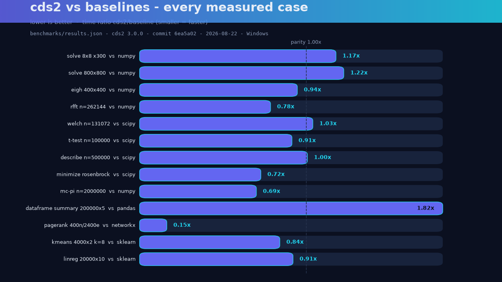

# CDS v2 benchmarks

## Provenance

This table is a transcription of the committed machine-readable results in
[`benchmarks/results.json`](https://github.com/Furox-Art/scientific-computing-system-2.0/blob/main/benchmarks/results.json).
Do not edit the numbers by hand; regenerate them with
`benchmarks/run_benchmarks.py`.

| Field | Value |
|---|---|
| CDS2 version | **3.0.0** (not the current release) |
| Git commit | `6ea5a02` (= tag `v3.0.0`) |
| Run timestamp (UTC) | 2026-08-22T15:13:41 |
| Platform | Windows-11-10.0.26200-SP0, Intel64 Family 6 Model 170 Stepping 4 |
| Python | 3.12.10 |
| numpy / scipy / pandas | 2.4.0 / 1.17.0 / 3.0.3 |
| networkx / scikit-learn | 3.6.1 / 1.9.0 |

> These timings predate the current release line and one contributor machine.
> They are engineering measurements, not universal performance claims. See
> [Benchmark methodology](benchmark-methodology.md) before quoting any ratio.

## Results

Ratio is cds2 time divided by baseline time: 1.00x means parity with the
underlying library. Rows above 1.00x are cases where cds2 was slower in
this run.

| Benchmark | Baseline | Baseline (s) | cds2 (s) | cds2/baseline |
|---|---|---:|---:|---:|
| solve 8x8 x300 | numpy | 0.001703 | 0.002000 | 1.17x |
| solve 800x800 | numpy | 0.011891 | 0.014525 | 1.22x |
| eigh 400x400 | numpy | 0.074720 | 0.070310 | 0.94x |
| rfft n=262144 | numpy | 0.004206 | 0.003277 | 0.78x |
| welch n=131072 | scipy | 0.027046 | 0.027981 | 1.03x |
| t-test n=100000 | scipy | 0.001268 | 0.001152 | 0.91x |
| describe n=500000 | scipy | 0.033102 | 0.033154 | 1.00x |
| minimize rosenbrock | scipy | 0.006049 | 0.004359 | 0.72x |
| mc-pi n=2000000 | numpy | 0.050287 | 0.034881 | 0.69x |
| dataframe summary 200000x5 | pandas | 0.055953 | 0.101789 | 1.82x |
| pagerank 400n/2400e | networkx | 0.003661 | 0.000559 | 0.15x |
| kmeans 4000x2 k=8 | sklearn | 0.016619 | 0.013880 | 0.84x |
| linreg 20000x10 | sklearn | 0.005879 | 0.005379 | 0.91x |

*Figure: every row of `benchmarks/results.json` (cds2 3.0.0, 2026-08-22),
winners and losers. Generated by `scripts/make_promo.py` from the JSON file,
never hand-edited.*

Wrapper-only rows (solve, fft, welch, t-test, minimize) demonstrate
that the cds2 API layer adds no measurable cost over calling
NumPy/SciPy directly. Rows where cds2 returns strictly more
information (describe adds quartiles; dataframe summary adds nulls
and uniques per column) carry a small honest premium for it.
Specialist rows (NetworkX, scikit-learn) show where pure-NumPy
implementations win or lose against compiled C code.
